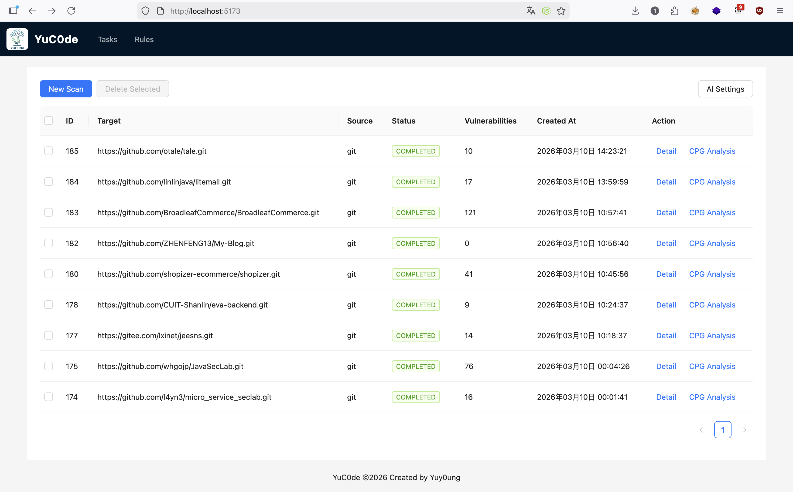
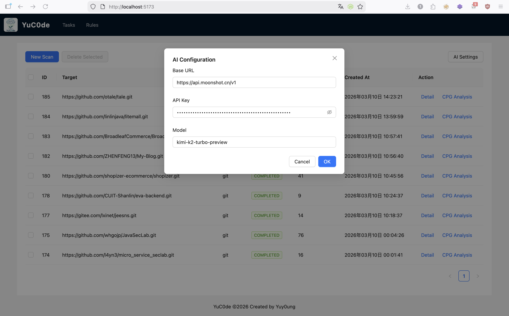
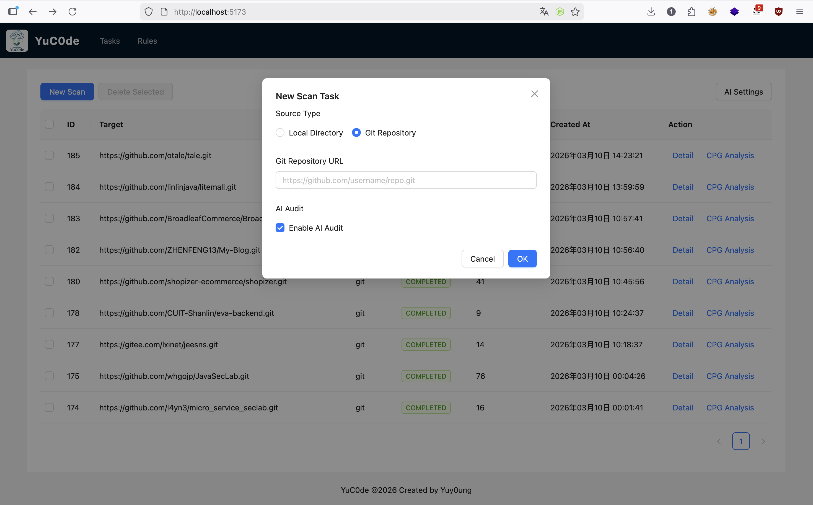
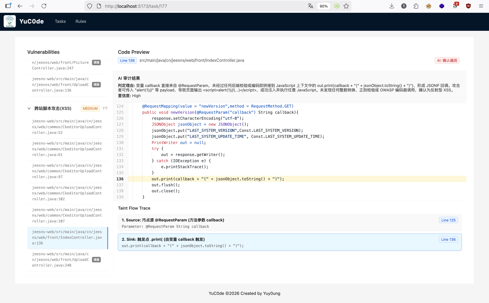
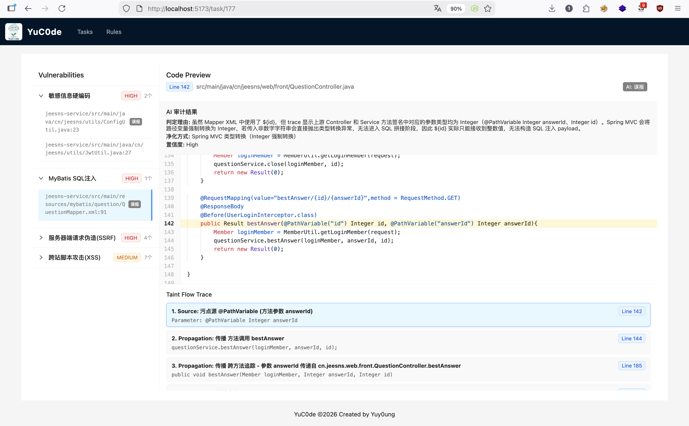
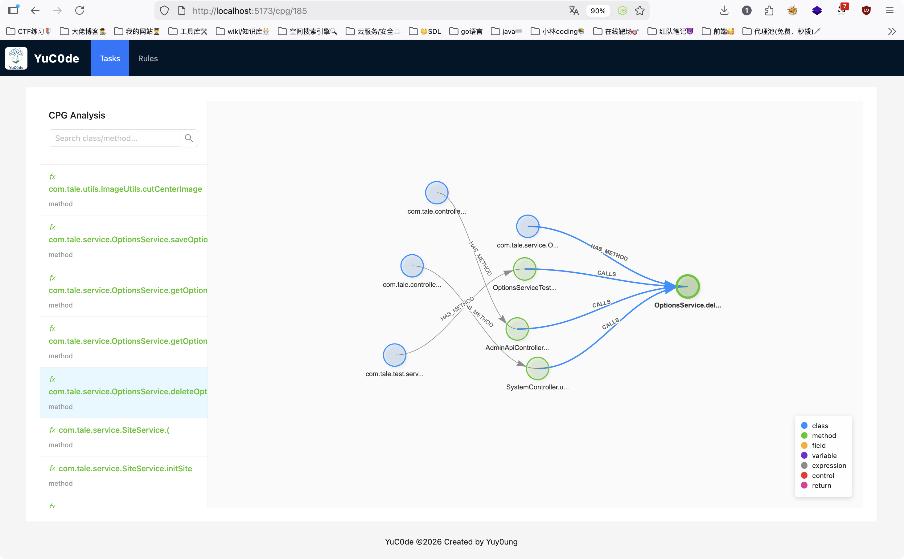
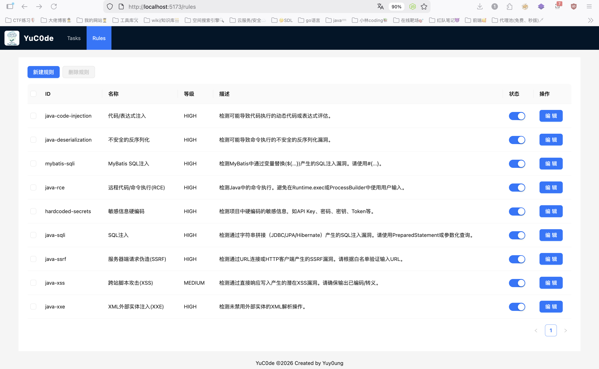
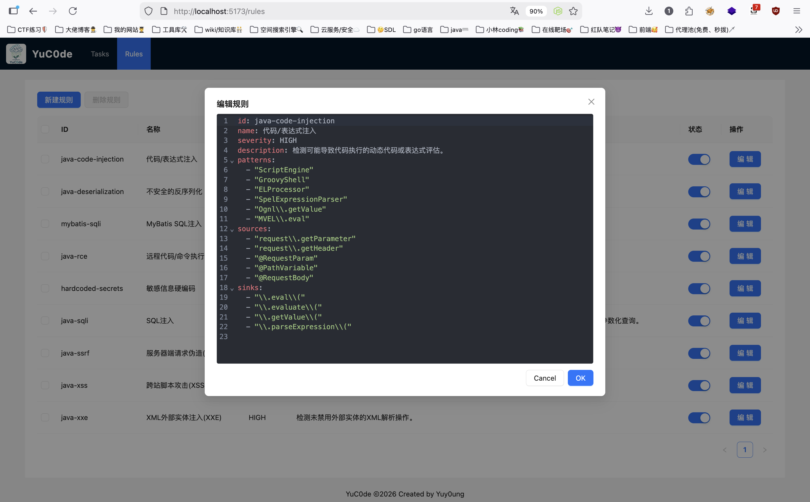

# YuC0de (雨蔻)

YuC0de (雨蔻) 是一款无需编译的Java静态应用程序安全测试 (SAST) 工具。它结合了轻量化代码属性图 (CPG) 分析技术与大语言模型 (LLM) 的语义理解能力，能够高效、准确地识别代码中的安全漏洞。YuC0de 通过解析源代码构建属性图，追踪数据流与控制流，并引入 AI 审计模块对检测结果进行二次校验，显著降低了误报率。它支持对 Java 语言项目的安全审计，覆盖 SQL 注入、远程代码执行 (RCE)、服务端请求伪造 (SSRF) 等多种高危漏洞类型。

## 核心亮点

*   **无需编译**：直接对Java源代码进行解析和分析，无需配置复杂的构建环境，极大降低了使用门槛。
*   **双重引擎**：融合了基于规则的静态分析引擎与基于 AI 的智能审计引擎，兼顾了检测速度与准确性。
*   **图驱动分析**：内置轻量化代码属性图 (CPG) 构建模块，支持深入的数据流分析和污点追踪，能够发现跨函数、跨文件的复杂漏洞。
*   **可视化交互**：提供直观的 Web 界面，支持漏洞链路的可视化展示、代码预览以及扫描规则的在线编辑。
*   **AI 赋能**：自实现类似langgraph架构对扫描结果进行多轮智能研判，自动识别误报并提供修复建议。

## 快速开始

### 前置要求
*   Go 1.20+
*   Node.js 16+
*   OpenAI API Key (可选，用于 AI 审计功能)

### 启动后端
1.  进入后端目录：
    ```bash
    cd yucode/backend
    ```
2.  下载依赖：
    ```bash
    go mod download
    ```
3.  启动服务：
    ```bash
    go run .
    ```

### 启动前端
1.  进入前端目录：
    ```bash
    cd yucode/frontend
    ```
2.  安装依赖：
    ```bash
    npm install
    ```
3.  启动开发服务器：
    ```bash
    npm run dev
    ```

访问浏览器地址 (默认为 http://localhost:5173) 即可开始使用。

## 功能展示

主页：


AI参数配置：


新建扫描任务（可选择是否开启AI审计）：



扫描结果详情：


AI分析可标记误报，降低人工审核成本：


图分析可以查看项目中的类/方法/变量的轻量化CPG上下游节点：



规则管理，可启用/禁用/新建/删除规则：



规则编辑：



## 项目结构

```text
yucode/
├── backend/                # 后端核心代码
│   ├── cpg/                # 轻量化代码属性图 (CPG) 分析模块
│   ├── engine/             # 静态分析引擎 (解析器、扫描器、索引器)
│   ├── rules/              # 漏洞扫描规则文件 (YAML)
│   ├── ai_audit.go         # AI 审计逻辑实现
│   └── main.go             # 程序入口
├── frontend/               # 前端 Web 应用
│   ├── src/
│   │   ├── views/          # 页面视图 (任务列表、详情、规则编辑、CPG分析)
│   │   ├── components/     # 通用组件
│   │   └── router/         # 路由配置
│   └── vite.config.js      # Vite 配置文件
└── README.md               # 项目说明文档
```
